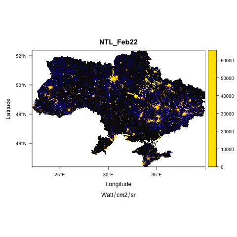

```{r setup, include=FALSE}
knitr::opts_chunk$set(collapse = TRUE)
library(ggplot2); library(data.table);library(fixest);library(raster);library(rasterVis)
library(animation); library(mapview)
options(scipen=99)

# For ColorCombos382 palette
ntlcol <- c("#09090c", "#19192f",'#1212b8','#f39C12',"#ffb300",'#FFC300',"#ffe200")
# cuts
cuts=c(0,1,2,5,10,20,50,100,500,65535)
mntit <- c("NTL_Feb22","NTL_Mar22","NTL_Apr22","NTL_May22","NTL_Jun22")
```


Each passing day of the Ukrainian invasion is taking a toll on not only the lives but the future livelihood of millions. With optimism on war nearing its end, its important to start taking a stock of the extent of loss in public infrastructure, natural-resources and worst hit regions. Doing so, will not only help in targeting focused reparative efforts but also save time in policy reforms till surveys and ground assessments are undertaken.

Satellite data is a useful resource in the absence of real time data. Imagery from daytime satellites have already proven to be useful learning of the initial [encroachment by Russian army](https://www.space.com/russia-ukraine-invasion-satellite-photos), and how Russia strategically targeted [Ukrainian grains](https://www.wired.com/story/satellites-ukraine-russia-grain/). Nightlights can help in assessing the extent of economic disruption from loss in electrification, demolition of houses, public infrastructure.


## Assessing impact of war in Ukarine from nightlights

The following images show the drastic drop in nightlights across Ukraine from February to May 2022.


```{r message=F,echo=F,warning=FALSE}
pthuk <- "/Users/parthkhare/Desktop/CGD/Projects/Ukraine FB Mobility NTL/nightlights/Ukraine mosaics/2022"
alras <- list.files(pthuk, pattern = ".*tif", full.names = T)

rjan <-  raster(alras[3])
proj4string(rjan) <- CRS("+init=epsg:4326")

rfeb <-  raster(alras[2])
rmar <-  raster(alras[6])
rapr <-  raster(alras[1])
rmay <-  raster(alras[7])
proj4string(rmay) <- CRS("+init=epsg:4326")

rjun <-  raster(alras[5])
rjul <-  raster(alras[4])


levelplot(rjan, at=cuts, par.settings=rasterTheme(ntlcol),main='Feb 2022',
          sub=expression(Watt/cm2/sr),pretty=T,maxpixels = 1e6, margin=F)
mapView(rjan, col.regions = ntlcol, at=cuts, maxpixels=8222466, alpha.regions = 0.9, zoom=6)


levelplot(rmay, at=cuts, par.settings=rasterTheme(ntlcol),main='May 2022',
          sub=expression(Watt/cm2/sr),pretty=T,maxpixels = 1e6, margin=F)
mapView(rmay, col.regions = ntlcol, at=cuts, maxpixels=8222466, alpha.regions = 0.9,zoom=6)

```
Blue and yellow lit regions represent major cities 

<br />
<br />


```{r message=F,echo=F,warning=FALSE}

```


Drop in nightlights across months

  


- NOTE 
  - It should be remembered that lights are not exactly income. While they can be used and have proven to be a helpful proxy for estimating economic growth. 
  - Nightlight measures radiance of light in Watt/cm2/sr, and all the maps here use the same legend for comparing results ovetime
  - Nightlights data for month of June seems to been biased by external noise from shells and not included here
